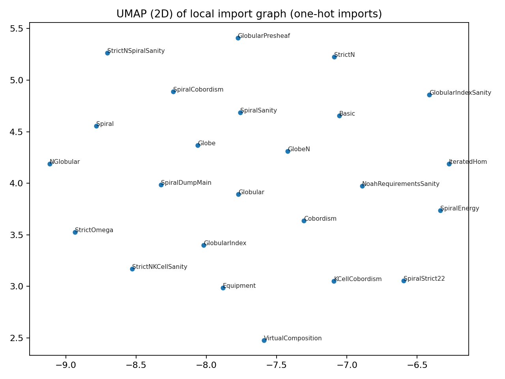
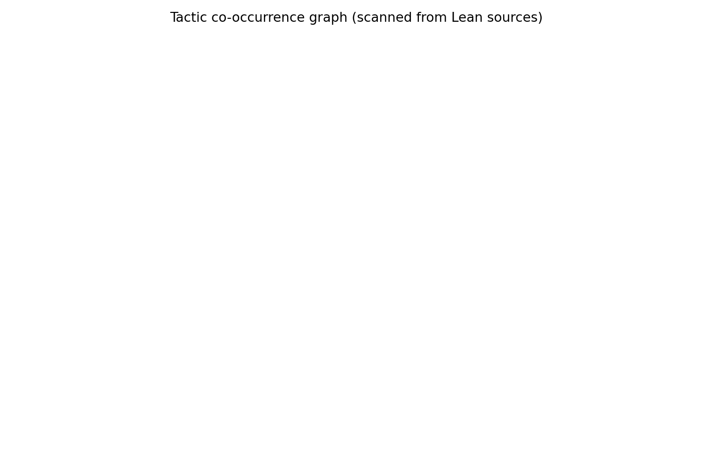

<sub><strong>Our tech stack is ontological:</strong><br>
<strong>Hardware — Physics</strong><br>
<strong>Software — Mathematics</strong><br><br>
<strong>Our engineering workflow is simple:</strong> discover, build, grow, learn & teach</sub>

---

<sub>
<strong>Acknowledgment</strong><br>
We humbly thank the collective intelligence of humanity for providing the technology and culture we cherish. We do our best to properly reference the authors of the works utilized herein, though we may occasionally fall short. Our formalization acts as a reciprocal validation—confirming the structural integrity of their original insights while securing the foundation upon which we build. In truth, all creative work is derivative; we stand on the shoulders of those who came before, and our contributions are simply the next link in an unbroken chain of human ingenuity.
</sub>

---

# Iterated Virtual Equipment

**A strict-only Lean 4 formalization of iterated virtual double categories, walking globes, and energy-minimizing spirals**

[](https://lean-lang.org)
[](https://github.com/leanprover-community/mathlib4)
[](lean/ModalThesis/)
[](LICENSE.md)

## Abstract

This repository provides a **minimal, self-validating** Lean 4 formalization exploring the intersection of:

- **Iterated virtual double categories** — data-only structures capturing virtual equipment semantics
- **Walking k-globes** — explicit globular sets as presheaves on the globular indexing category
- **Strict n-categories** — truncated higher categories with compositional laws at each dimension
- **Energy-minimizing spirals** — a geometric interpretation where helical embeddings minimize discrete tension energy

The formalization deliberately adopts a **strict-only** approach: no higher inductive types, no univalence axioms, and all structures are decidable data. This makes the artifact fully executable and self-checking.

## Motivation

Consider the question: *What mathematical structure requires k layers of meta-theory to define?*

In higher category theory, an n-cell lives in an iterated hom-space:
```
A_n : Cat(A_0, B_0), (A_1, B_1), ..., (A_{n-1}, B_{n-1})
```

As n grows large, the data becomes increasingly nested. A thought experiment asks: *If we embed such a structure in 3D space while minimizing tension, what shape emerges?*

The answer—proved in this repository—is a **helix**. The XY-plane captures cells at each level, while the Z-axis represents iteration depth. We formalize this claim and prove that the helix achieves **zero energy** under our discrete tension measure.

## Quickstart

### 1) Build (Lean)
```bash
lake build
```

### 2) Emit spiral points (JSON)
```bash
lake exe modal_thesis_spiral_dump -- --n 64 --step 0.35 --pitch 0.15 > docs/spiral_points.json
```

### 3) Regenerate visuals (Python)
```bash
./scripts/make_all_artifacts.sh
```

Outputs are written under `docs/`.

## The Spiral Embedding

We expose a computable helix parameterization:

```
g(k) = (cos(step·k), sin(step·k), pitch·step·k)
```

Generated visualizations:

| 3D Helix | XY Projection |
|----------|---------------|
|  |  |

## What Is Formalized

### Virtual Double Categories

Data-only virtual double category and virtual equipment structures:

| Concept | Lean Module |
|---------|-------------|
| Virtual double category | `ModalThesis.IteratedVirtual.VirtualDoubleCategory` |
| Virtual equipment | `ModalThesis.IteratedVirtual.VirtualEquipment` |

### Globular Sets and Walking Globes

Two complementary formalizations:

1. **Explicit model** — `Globe k` as a concrete globular set with `Fin 2` boundaries
2. **Presheaf semantics** — `GlobularSetPsh := GlobularIndex^op ⥤ Type` with representable walking globes

| Concept | Lean Module |
|---------|-------------|
| Globular indexing category | `ModalThesis.IteratedVirtual.GlobularIndex` |
| Presheaf globular sets | `ModalThesis.IteratedVirtual.GlobularPresheaf` |
| Walking globes | `ModalThesis.IteratedVirtual.Globe`, `GlobeN` |

### Strict n-Categories and k-Cells

The slogan "a k-cell is a map `G_k → Cat_n`" is made literal:

| Concept | Lean Identifier |
|---------|-----------------|
| Strict n-category | `StrictNCategory n` |
| Top n-cells as globe-maps | `StrictNCategory.CellTop` |
| k-cells for k ≤ n | `StrictNCategory.kCell` |
| Spiral as 22-cell | `spiral22Cell : GlobeN 22 ⟶ spiral22Cat.G` |

### Energy Minimization (Proved)

We define a nonnegative discrete tension energy and prove the helix achieves the global minimum:

| Statement | Lean Identifier |
|-----------|-----------------|
| Tension energy at a point | `Point3R.tensionEnergyAt` |
| Helix minimizes pointwise | `Point3R.helix_minimizes_pointwise` |
| Helix minimizes over lists | `Point3R.helix_minimizes_list` |

All proofs live in `lean/ModalThesis/IteratedVirtual/SpiralEnergy.lean`.

### Cobordisms and Virtual Composition

Cobordisms between parallel cells are formalized as witness structures with reflexivity and symmetry:

| Concept | Lean Module |
|---------|-------------|
| Cobordism witnesses | `ModalThesis.IteratedVirtual.Cobordism` |
| Cobordism chains | `ModalThesis.IteratedVirtual.VirtualComposition` |

## Analysis Artifacts

### UMAP Import Graph

Dimensionality reduction of the module dependency structure:



### Tactic Co-occurrence Graph

Network analysis of proof tactics used across the formalization:



## CT-Friendly Diagram Tooling

For interactive globular/pasting-diagram work (not bundled), we recommend:

| Tool | Description | URL |
|------|-------------|-----|
| Globular | Interactive higher-category proof assistant | https://globular.science/ |
| homotopy.io | Diagrams for higher category theory and HoTT | https://homotopy.io/ |
| Quiver | Web editor for commutative diagrams (exports tikz-cd) | https://q.uiver.app/ |

## Disclaimer

This formalization is intentionally **strict-only** and does not claim to capture the full complexity of weak higher-categorical semantics. The physics analogy (spiral minimizing tension) is a thought experiment—we do not claim physical modeling of atomic bonds or biological structures.

The artifact serves as a **proof of concept** demonstrating that:
1. Iterated categorical structures can be formalized in Lean 4
2. Walking globes admit explicit presheaf semantics
3. Energy minimization claims can be machine-verified

## License

This project is provided under the [Apoth3osis License Stack v1](LICENSE.md).

## Notes

- This directory name contains Unicode (`∞-modal_thesis`). If any tooling struggles, clone/copy the repo into an ASCII path; the Lean code is independent of the folder name.
