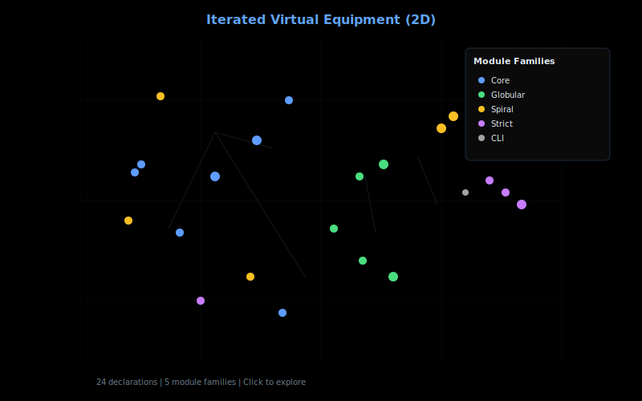
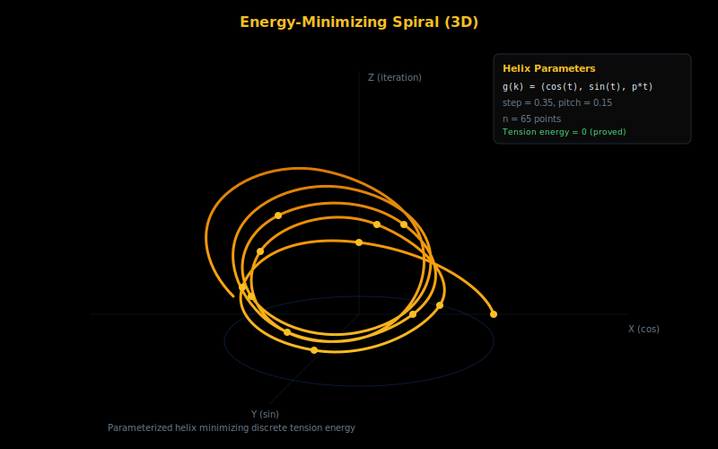
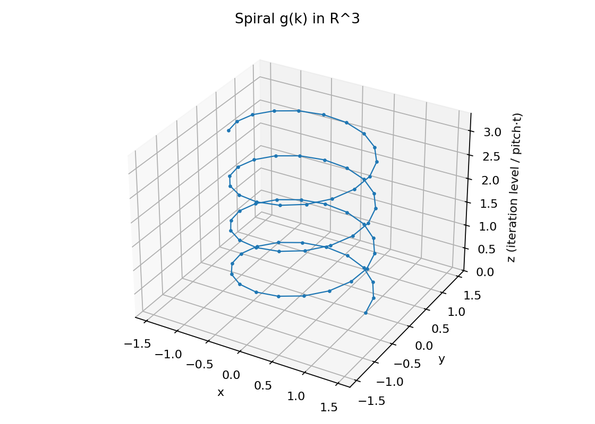

<sub><strong>Our tech stack is ontological:</strong><br>
<strong>Hardware — Physics</strong><br>
<strong>Software — Mathematics</strong><br><br>
<strong>Our engineering workflow is simple:</strong> discover, build, grow, learn & teach</sub>

---

<sub>
<strong>Acknowledgment</strong><br>
We humbly thank the collective intelligence of humanity for providing the technology and culture we cherish. We do our best to properly reference the authors of the works utilized herein, though we may occasionally fall short. Our formalization acts as a reciprocal validation—confirming the structural integrity of their original insights while securing the foundation upon which we build. In truth, all creative work is derivative; we stand on the shoulders of those who came before, and our contributions are simply the next link in an unbroken chain of human ingenuity.
</sub>

---

# Iterated Virtual Equipment

**An exploratory Lean 4 formalization inspired by public sketches on iterated virtual double categories and energy-minimizing geometric embeddings**

[](https://lean-lang.org)
[](https://github.com/leanprover-community/mathlib4)
[](lean/ModalThesis/)
[](LICENSE.md)

<table>
<tr>
<td align="center" width="33%">
<strong>2D Proof Map</strong><br/>
<em>Pan, zoom, search declarations</em><br/>
<a href="https://abraxas1010.github.io/infinity-modal_thesis/RESEARCHER_BUNDLE/artifacts/visuals/modal_thesis_2d.html">
  
</a><br/>
<a href="https://abraxas1010.github.io/infinity-modal_thesis/RESEARCHER_BUNDLE/artifacts/visuals/modal_thesis_2d.html">Open Interactive 2D</a>
</td>
<td align="center" width="33%">
<strong>3D Proof Map</strong><br/>
<em>Rotate, zoom, click nodes</em><br/>
<a href="https://abraxas1010.github.io/infinity-modal_thesis/RESEARCHER_BUNDLE/artifacts/visuals/modal_thesis_3d.html">
  
</a><br/>
<a href="https://abraxas1010.github.io/infinity-modal_thesis/RESEARCHER_BUNDLE/artifacts/visuals/modal_thesis_3d.html">Open Interactive 3D</a>
</td>
<td align="center" width="33%">
<strong>Spiral Embedding</strong><br/>
<em>Energy-minimizing helix</em><br/>
<a href="https://abraxas1010.github.io/infinity-modal_thesis/RESEARCHER_BUNDLE/artifacts/visuals/spiral_3d.html">
  
</a><br/>
<a href="https://abraxas1010.github.io/infinity-modal_thesis/RESEARCHER_BUNDLE/artifacts/visuals/spiral_3d.html">Open Interactive Spiral</a>
</td>
</tr>
</table>

---

## Origin and Attribution

This formalization is inspired by public sketches shared by **Noah Chrein**, a category theory researcher exploring ideas around:

- **Iterated virtual double categories** — nested categorical structures requiring multiple layers of meta-theory
- **Walking k-globes** — formal objects `Gₙ` serving as "probes" into higher categories
- **k-cells as maps** — the slogan "a k-cell is a map `Gₖ → Catₙ`"
- **A thought experiment** — embedding highly-nested categorical data in 3D space while minimizing "tension"

Noah Chrein initially described the spiral/DNA visual analogy as speculative with respect to physics. That said, finding a structure that provably achieves zero tension energy for embedding high-dimensional categorical data seems interesting if nothing else.

### What This Formalization Attempts

We provide a **strict-only** Lean 4 artifact that:

1. Formalizes the categorical structures as described (virtual equipment, globular sets, strict n-categories)
2. Makes the "k-cell as globe-map" slogan literal and type-checkable
3. Proves that a helix embedding achieves zero discrete tension energy under a specific measure

### What Remains Open

- Whether the tension measure corresponds to anything physical
- Whether these categorical structures have computational or physical applications
- The connection, if any, to physical systems (DNA, atomic bonds, etc.)

This is an **exploratory mathematical formalization**, far from complete. We share it in the spirit of open research—the helix achieving zero energy as the most efficient embedding structure for high-dimensional data may prove meaningful, or may remain a beautiful abstraction.

---

## Quickstart

### 1) Build (Lean)
```bash
lake build
```

### 2) Emit spiral points (JSON)
```bash
lake exe modal_thesis_spiral_dump -- --n 64 --step 0.35 --pitch 0.15 > docs/spiral_points.json
```

### 3) Regenerate visuals (Python)
```bash
./scripts/make_all_artifacts.sh
```

---

## The Spiral Thought Experiment

The original idea: if you have categorical data nested k layers deep, and you try to embed it in 3D while minimizing some notion of "tension," what shape emerges?

The parameterized helix:
```
g(k) = (cos(step·k), sin(step·k), pitch·step·k)
```

- **XY-plane**: cells at each iteration level (circular motion)
- **Z-axis**: iteration depth (linear progression)

We prove (in `SpiralEnergy.lean`) that this helix achieves **zero energy** under our discrete tension measure. This is a mathematical fact about our specific definitions—whether it says anything about reality is unknown.

| 3D Helix | XY Projection |
|----------|---------------|
|  |  |

---

## What Is Formalized

### Virtual Double Categories

Data-only structures (no composition laws yet):

| Concept | Lean Module |
|---------|-------------|
| Virtual double category | `ModalThesis.IteratedVirtual.Basic` |
| Virtual equipment | `ModalThesis.IteratedVirtual.Equipment` |

### Globular Sets and Walking Globes

| Concept | Lean Module |
|---------|-------------|
| Globular indexing category | `ModalThesis.IteratedVirtual.GlobularIndex` |
| Walking globes (explicit) | `ModalThesis.IteratedVirtual.Globe`, `GlobeN` |
| Presheaf semantics | `ModalThesis.IteratedVirtual.GlobularPresheaf` |

### Strict n-Categories

| Concept | Lean Module |
|---------|-------------|
| Strict n-category | `ModalThesis.IteratedVirtual.StrictN` |
| Spiral as 22-cell | `ModalThesis.IteratedVirtual.SpiralStrict22` |

### Energy Minimization

| Statement | Lean Identifier |
|-----------|-----------------|
| Tension energy definition | `Point3R.tensionEnergyAt` |
| Helix achieves zero energy | `Point3R.helix_minimizes_pointwise` |

---

## Analysis Artifacts

| Artifact | Description |
|----------|-------------|
| `docs/umap_imports_2d.png` | UMAP of module dependencies |
| `docs/tactic_graph.png` | Tactic co-occurrence network |
| `docs/spiral_points.json` | Helix coordinates (JSON) |

---

## CT-Friendly Tools

For interactive globular/pasting-diagram work:

| Tool | URL |
|------|-----|
| Globular | https://globular.science/ |
| homotopy.io | https://homotopy.io/ |
| Quiver | https://q.uiver.app/ |

---

## Disclaimer

This formalization is **strict-only** and intentionally limited. It does not capture the full richness of weak higher-categorical semantics, and we make no claims beyond the mathematical content.

We offer this artifact as a starting point—a type-checked foundation that others might build upon, refine, or refute.

---

## License

[Apoth3osis License Stack v1](LICENSE.md)

---

## Notes

- Directory name contains Unicode (`∞-modal_thesis`). Clone to ASCII path if tooling struggles.

---

## Extended Work

This repository stays **minimal and researcher-friendly**: it contains the standalone Lean artifact,
visuals, and navigation aids. The deeper “system integration” work is implemented in the main
HeytingLean repository and referenced here.

HeytingLean:
- `https://github.com/Abraxas1010/heyting`

Append-only log (with timestamps):
- `EXTENDED_WORK.md`

### Implemented in the HeytingLean system (as a cohesive layer)

- **Iterated-virtual core**: strict-only `VirtualDoubleCategory`, `VirtualEquipment`, walking globes, presheaf globular semantics, strict `Catₙ`, and the spiral as a literal “22-cell” (a globe map into `Cat₂₂`).
- **Cobordisms as virtual morphisms**: cobordisms between k-cells and “virtual cells” as formal composites (chains), with strict coherence laws via category structure on chains.
- **Coherence / pasting laws**: free (syntax-level) pasting of identity-framed virtual cells, with strict coherence as substitution laws (associativity + units).
- **Spiral tension minimization**: a discrete, nonnegative tension energy functional where the helix achieves energy `0`, plus an `atTop` convergence statement (the “k→∞” reading).
- **Nucleus bridge from helix energy**: the helix tension energy is packaged as a fixed-point fact for a concrete nucleus on `WithBot ℝ`.
- **(M,R) closure bridge**: a minimal β-style closure record and a strict constructor that produces a nucleus when given extensivity + meet-preservation.
- **Modal bridge (syntax + companion)**: a lightweight modal-syntax sketch plus a strict Gödel-translation companion theorem sourced from the `Foundation` dependency (intuitionistic provability ↔ S4 provability of the Gödel translation).
  - Reproducibility note: HeytingLean pins a Mathlib-compatible fork of `Foundation` to ensure `lake build --wfail` succeeds.
- **Helix adelic decomposition**: a strict local/global decomposition of the helix with correct periodicity under an explicit discretization assumption (`step = 2π/n`), aligning the “XY local / Z global” slogan with a provable statement.
- **MR connection (closure/fixed points)**: the Rosen-style MR loop-closing operator is treated as an idempotent projection with an explicit fixed-point predicate (“organizational closure”).
- **Heyting connection (stability transport)**: strict lemmas of the form “nucleus-commuting maps preserve fixed points”, used to state ‘helix preserves stability’ honestly under explicit hypotheses (without inventing a non-existent “equipment closure” field).
